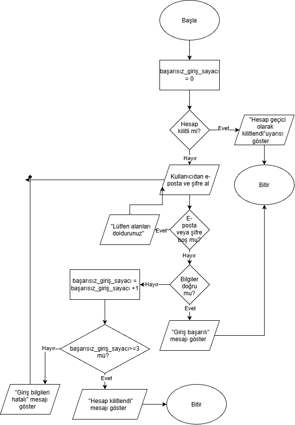

# Kullanıcı Giriş Akışı - Algoritma Diyagramı

## Projenin Amacı
Bu çalışma, bir web uygulamasındaki güvenli kullanıcı giriş sürecinin adım adım mantıksal işleyişini modeller. Kullanıcı doğrulama, boş alan denetimi ve hatalı giriş sınırlandırma mekanizmalarını kurallara uygun bir akış diyagramı olarak sunmayı amaçlar.

## İş Kuralları
- Hesabın kilitli olup olmadığı kontrol edilir.
- Boş e-posta veya şifre alanı için uyarı gösterilir.
- Doğru bilgilerde başarılı giriş sonucu gösterilir.
- Yanlış girişte sayaç artırılır.
- Üç başarısız denemede hesap kilitlenir.

## Akış Diyagramı

## Test Senaryoları
| Senaryo | Beklenen sonuç |
|---|---|
| Hesap kilitli | Giriş engellenir |
| E-posta veya şifre boş | Uyarı gösterilir, sayaç artmaz |
| Bilgiler doğru | Başarılı giriş |
| Üçüncü yanlış deneme | Hesap kilitlenir |

## Tasarım Kararları
Akışın başında kilitli hesapların sisteme gereksiz sorgu yapmasını engellemek adına ilk olarak hesap kilit durumu kontrol edilmiştir. Boş bırakılan alanlar bir şifre denemesi sayılmadığı için sayaç artırılmamış, yalnızca geçersiz e-posta/şifre denemelerinde sayaç 1 artırılmıştır. Üçüncü hatalı denemede hesap kilitlenerek akış sonlandırılır.

